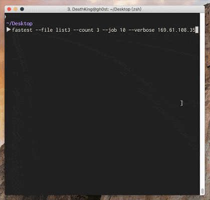

# FastestServer

Find the fastest server via ping.

## Installation

    $ gem install fastest_server

## Usage

The most basic usage is very simple

    $ fastest servers ...
    
There are some options available, considered following command:

    $ fastest --file list --count 3 --job 10 --verbose 169.61.108.35

Where,

+ `-f` or `--file` option will load servers ip or uri  (one server per line) from a file named `list`;
+ `-c` or `--count` option specify the maximum number of packets will be sent (default: 10);
+ `-j` or `--job` option specify the maximum number of ping job run at once (default: 8);
+ `-v` or `--verbose` flag enable printing a more useful status and statistic information, otherwise only the fastest 
server will be displayed on the screen.

Noticed that, you can also provide additional servers as parameters, even a `-f` or `--file` option has been set.

## Contributing

Bug reports and pull requests are welcome on GitHub at https://github.com/DeathKing/fastest_server.
